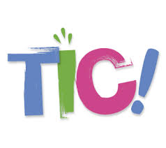
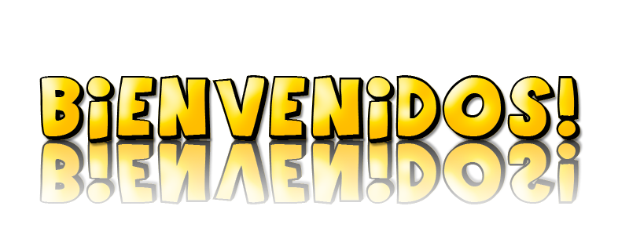

## 1.Categorías gramaticales {#1-categor-as-gramaticales}

Como profesores de Lengua Castellana y Literatura, debemos ofrecer a nuestros alumnos la posibilidad de que construyan de forma activa su propio conocimiento, tanto dentro como fuera del aula, dando pie a la experimentación,  investigación así como a la aplicación práctica y significativa de los conocimientos adquiridos al mismo tiempo que desarrollan destrezas como la ´´competencia de autonomía e iniciativa personal´´,  ´´aprender a aprender´´ y ´´ la digital´´  haciendo un uso correcto de las TIC.

Tomando como punto de partida lo citado en líneas anteriores, he estructurado los distintos contenidos didácticos del módulo uno  atendiendo, como ya he mencionado en otros apartados, a la metodología Flipped Classroom o Aula Invertida basada en la modalidad ´´blended-learning´´ (enseñanza semipresencial) combinando el trabajo en el aula con el trabajo en cualquier otro espacio alterno a la misma.

Dicho esto…. vamos a ponernos manos a la obra con el contenido del curso: Las SINTAXIS y las TIC.

                                                                       Y  

