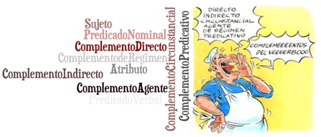

# 4.Los complementos verbo {#4-los-complementos-verbo}

Una vez estudiados los constituyentes inmediatos de la oración simple : Sujeto y Predicado, vamos a plantear una serie de alternativas para poder trabajar con nuestro alumnos los distintos complementos que aparecen en el Predicado utilizando como alidadas a las TIC.

Así, los objetivos que vamos a alcanzar una vez finalizado el módulo son: