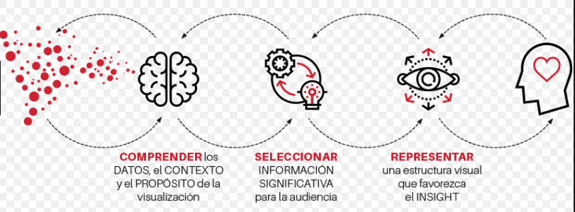
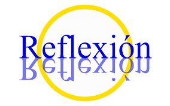
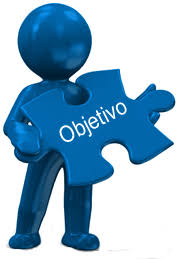

#                                              

Sin embargo, antes de ponernos manos a la obra, considero interesante tener presente, en el momento en el que planifiquemos nuestra clase  la consideración, de [Daniel del Amo](https://www.google.com/url?q=https://www.theflippedclassroom.es/niveles-fases-y-tiempos-en-la-analitica-del-aprendizaje/&sa=D&ust=1509617244698000&usg=AFQjCNGXdJZly3oDLgolXl3_GPHhIKxweA), al diferenciar los distintos niveles, fases y tiempos que conforman todo análisis de aprendizaje:

NIVEL I: EXPLICAR

*   Fase: Visualización de los datos.
*   Tiempo Presente y Pasado.
*   Responde a la pregunta: ¿Qué ha pasado? y ¿Qué está pasando?

NIVEL II: DIAGNOSTICAR

*   Fase: Análisis de las visualizaciones.
*   Tiempos: Presente y Pasado.
*   Responde a las preguntas: ¿Cómo y por qué pasó? y ¿Cómo y por qué está pasando?

NIVEL III: PREDECIR

*   Fase: Interpretación del análisis.
*   Tiempo: Futuro
*   Responde a la pregunta: ¿Qué puede pasar?

NIVEL IV: PRESCRIBIR

*   Fase: Interpretación de las predicciones o análisis
*   Tiempos: Presente y Futuro.
*   Responde a las preguntas:  ¿Cómo podemos actuar? y ¿Cómo prevenir lo negativo y potenciar lo positivo?

                                      [https://www.youtube.com/watch?v=cvW7J6zk_PY](https://www.google.com/url?q=https://www.youtube.com/watch?v%3DcvW7J6zk_PY&sa=D&ust=1509617244701000&usg=AFQjCNHXHnZBhfjGzT_TC-6WBf4z18V7tA) 

La pretensión  final del presente módulo consiste en que, como profesores, adquiramos los conocimientos, recursos y herramientas suficientes para ser capaces de poder llevar a cabo nuevos modelos pedagógicos en nuestra aula adaptándonos a las nuevas exigencias presentes en el ámbito educativo actual  facilitando al alumnado su tarea como agente en la construcción de su propio conocimiento.

[^a]Para ello, en un primer momento, deberemos reflexionar sobre las siguientes cuestiones:

1.  ¿Qué pretendo conseguir dándole un nuevo enfoque a mis clases de Sintaxis?
2.  ¿Soy conocedor de las diversas posibilidades que me ofrecen las nueva metodologías?
3.  ¿Me siento preparado para poder ponerlas en práctica con mis alumnos?
4.  ¿Conozco las distintas herramientas, recursos y actividades que tengo en mi alcance para ello?
5.  ¿Poseo un criterio selectivo según mis intereses en cada momento?

Con la pretensión de dar respuesta a todas estas cuestiones planteadas, procederemos a desarrollar cada uno de los OBJETIVOS GENERALES que que pretender alcanzar a través de este primer módulo:

*   Conocer el funcionamiento y las distintas fases que conforman la metodología Flipped Classroom o Aula Invertida para su posterior aplicación en el aula.
*   Facilitar un enfoque de cómo usar Flipped Classroom aportando ideas para su aplicación práctica en el aula en la modalidad blended learning en la materia de Lengua Castellana y Literatura.
*   Presentar diferentes herramientas tecnológicas con sus características específicas para su posterior uso a la hora de diseñar, planificar las clases de Lengua.
*   Facilitar actividades que despierten la creatividad del alumnado desarrollando sus distintas capacidades, habilidades y destrezas.
*   Confeccionar vídeos educativos por medio de distintas herramientas digitales Videoescribe y Edpuzzle para despertar la motivación del alumnado en su proceso de aprendizaje.
*   Valorar la importancia que tiene el uso de plataformas virtuales y los beneficios que aportan al alumnado como complemento de la enseñanza presencial.
*   Incluir el uso de la evaluación en línea mediante  el uso del sistema de rúbricas.

[^a]: