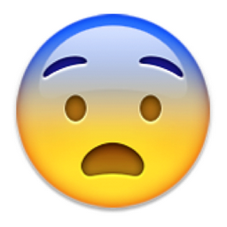
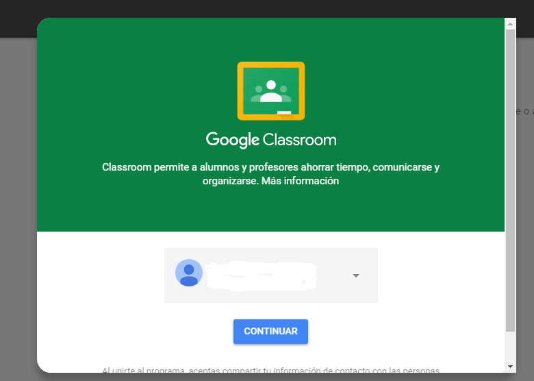

## Fase dos. Realización de actividades interactivas. {#fase-dos-realizaci-n-de-actividades-interactivas}

Una vez visualizado el vídeo explicativo propuesto al alumnado acerca de las distintas categorías gramaticales, éstos deben poner en práctica los distintos contenidos que aparecen en la lección virtual proporcionada. Para ello, se le invita a realizar distintas actividades interactivas de consolidación. En el caso de que se cometan fallos, se recomienda volver a visualizar el vídeo tantas veces como lo crean conveniente.

La red nos proporciona gran cantidad de material virtual de carácter abierto  para llevar a cabo esta segunda fase en el aprendizaje del alumnado.

*   Actividades de repaso, combinando, en algunos casos, teoría y ejercicios.

*   [Teoría y ejercicios con soluciones](https://www.google.com/url?q=http://delenguayliteratura.com/MORFOLOGIA.html&sa=D&ust=1509617244720000&usg=AFQjCNE_jD_a-nWpALCpxM6fI68YpvqddA)
*   Reconocer categorías gramaticales [I](https://www.google.com/url?q=http://www.xtec.cat/~jgenover/gracat1.htm&sa=D&ust=1509617244721000&usg=AFQjCNGVBUJe-DTWQ57PHrRYqXUH9thByg), [II](https://www.google.com/url?q=http://www.xtec.cat/~jgenover/gracat3.htm&sa=D&ust=1509617244721000&usg=AFQjCNGPqh7ayrzaCau7maD0czTIsO5q5w) , [III](https://www.google.com/url?q=http://www.xtec.cat/~jgenover/gracat2.htm&sa=D&ust=1509617244722000&usg=AFQjCNHqzy65UCaro4D_5Sw8JzWDrXxrEg) y [IV](https://www.google.com/url?q=http://www.xtec.cat/~jgenover/catgram6.htm&sa=D&ust=1509617244722000&usg=AFQjCNGfGdJqKQNH7R8-v_cSOyoJrPD8IA)
*   Actividades de repaso [ I](https://www.google.com/url?q=https://www.cerebriti.com/juegos-de-lengua/categorias-gramaticales%23.Wc4rvWh-rcs&sa=D&ust=1509617244723000&usg=AFQjCNG4-sDlvpKQ3Ljm1N4ncJz8zfTzQw), [II](https://www.google.com/url?q=https://didactalia.net/comunidad/materialeducativo/recursos/tag/categor%25C3%25ADas%2520gramaticales&sa=D&ust=1509617244723000&usg=AFQjCNEYRVEyp_Nyq1gp9JMC9kI0uyRWRw), [III,](https://www.google.com/url?q=http://procomun.educalab.es/es/ode/view/1416349642995&sa=D&ust=1509617244723000&usg=AFQjCNE9MaW-h-qNyK9fu8bYIbmo5Q4hYQ) [IV](https://www.google.com/url?q=http://www.xtec.cat/~jgenover/catgram1.htm&sa=D&ust=1509617244724000&usg=AFQjCNGEztCTYoHXCpJ4UX2dPN0Vw0sf6Q)
*   Recopilación de páginas para repasar las categorías gramaticales I y[ II](https://www.google.com/url?q=http://www.xtec.cat/~jgenover/morfo.htm&sa=D&ust=1509617244725000&usg=AFQjCNEjl46_WbX1DhFMkxRfEJ_-2hnddA)

*   Juegos interactivos I y[ II](https://www.google.com/url?q=https://www.cerebriti.com/juegos-de-categor%25C3%25ADas%2Bgramaticales/tag/mas-recientes/&sa=D&ust=1509617244725000&usg=AFQjCNF8P8zJDqvVHDAz8cIU8pb_TipqNA):

Trabajar el repaso de las categorías gramaticales por medio  del juego donde el alumnado tiene un tiempo limitado de respuesta incrementar su motivación  al sentirse incitado a la acción mejorando tanto su capacidad de atención como su tiempo de reacción.

A lo largo de los siguientes módulos os iré proporcionando nuevas ideas y herramientas para que seáis vosotros los que elaboréis las actividades interactivas que vayan a trabajar vuestros alumnos.  

Llegado este punto, se os puede plantear la siguiente duda… ¿ y cómo proporciono yo a mis alumnos los enlaces a vídeos, contenidos, actividades interactivas, etc.?

¡¡¡¡NO OS PREOCUPÉIS !!!!!.  [Google Classroom](https://www.google.com/url?q=https://classroom.google.com/&sa=D&ust=1509617244727000&usg=AFQjCNGToA9H_Vz_JXtRe-aMlYO21AKBNQ) tiene la solución. Gracias a esta herramienta de carácter gratuito, entre otras  muchas funciones, se encuentra la poder enviar tareas por medio del correo electrónico a las que vosotros, como profesores, tendréis la oportunidad de agregar anotaciones en el mismo momento que las realicen.

                               