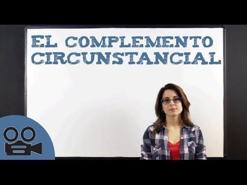
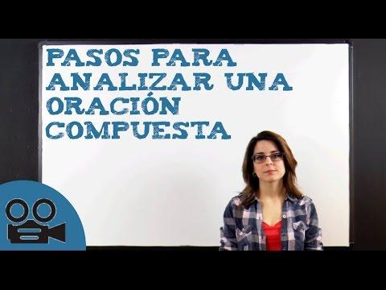

# Fase dos.En clase. {#fase-dos-en-clase}

Como docentes, somos conscientes de la importancia que han adquirido en el ámbito educativo las INFOGRAFÍA como transmisores de conocimientos a nuestros alumnos.

Existen muchísimas en Internet, sin embargo, os voy a proporcionar dos herramientas para que seáis vosotros mismos los encargados de elaborarlas y así se adapte a nuestras necesidades temáticas del momento y poder compartirlas libremente en el momento que lo deseemos.

[Easelly](https://www.google.com/url?q=http://www.easel.ly/&sa=D&ust=1509617244879000&usg=AFQjCNEOBf-v4h0ksP_6XyXQJiWb80pnmg):

Herramienta web de gratuita que, a partir diversos tipos de plantillas o partiendo de cero, te permite incluir texto, imágenes etc. por medio de herramientas de manejo sencillo y carácter intuitivo.

Para poder acceder a ella, tendréis que crear vuestra cuenta en Easelly Una vez acabada, te ofrece la posibilidad de exportarla en formato pdf  jpg, png o web para compartirlas  de modo online.

                                    Manual de Usuario         Vídeo tutorial

[Piktochart:](https://www.google.com/url?q=http://piktochart.com/&sa=D&ust=1509617244880000&usg=AFQjCNG20_JNw8p5GtYz0d3t-VkVo2uUeg) Otra aplicación on-line fantástica para hacer impresionantes infografías o presentaciones. Además, una de las cosas más interesantes es el poder ir creándolas a la vez que das la clase y una vez terminada guardarla o compartirla.  ¡Genial!

[https://www.educaryjugar.com/docentes/quizizz-otra-alternativa-a-kahoot/](https://www.google.com/url?q=https://www.educaryjugar.com/docentes/quizizz-otra-alternativa-a-kahoot/&sa=D&ust=1509617244881000&usg=AFQjCNE6BcBU9U855pKfbY-bTEaMHTrMeg) ( evaluación del alumnado)

I) PARTE INICIAL ( REALIZARLA EN CASA)

*   PARTE A

A) COMPLEMENTOS VERBALES I-

*   [  ANALIZADOR SINTÁCTICO ONLINE](https://www.google.com/url?q=https://linguakit.com/es/analizador-sintactico&sa=D&ust=1509617244882000&usg=AFQjCNG3DC1umD_sFAqD9c7_C_HfCFQA3Q)

*   Atributo

[Video link](https://www.google.com/url?q=http://youtube.com/watch?v%3DLfyOAKwXj3w&sa=D&ust=1509617244882000&usg=AFQjCNFvx8mWfG3qSaKyQEX9RizSzcQCzQ)

[Video link](https://www.google.com/url?q=http://youtube.com/watch?v%3D_u8qgjG9odk&sa=D&ust=1509617244883000&usg=AFQjCNF_LBjRJC2-Z25LoOLd1lUBrUSD0A)

[Video link](https://www.google.com/url?q=http://youtube.com/watch?v%3DrG6GvhFoC5I&sa=D&ust=1509617244883000&usg=AFQjCNGtzoU5036d-OQk7_PwR_oYqb7Spw)

[Mapa conceptual](https://www.google.com/url?q=http://cmapspublic2.ihmc.us/rid%3D1KGF1HNBX-KXCTX0-175B/EL%2520ATRIBUTO&sa=D&ust=1509617244884000&usg=AFQjCNE6-XlZiCYDx17VJEF-fisGYHwvng)

[El atributo](https://www.google.com/url?q=http://mdm.usta.edu.co/remos_downloads/lectoescritura/clara_jaramillo_nivelacion_lectoescritura_modulo1_oracion_julio12_2013/el_atributo.html&sa=D&ust=1509617244884000&usg=AFQjCNGKHQf5-ST0kBB1LVjJcopsADkNMA)

*   [Teoría](https://www.google.com/url?q=http://www.gramaticas.net/2012/03/ejemplos-de-atributo.html&sa=D&ust=1509617244885000&usg=AFQjCNGO-G5QZyt9yEaAd7hnxuCHjZSy8w)

-Complemento directo:

[Video link](https://www.google.com/url?q=http://youtube.com/watch?v%3D30rc0zwPg-k&sa=D&ust=1509617244885000&usg=AFQjCNEtU7Vlq8MMIkVIaaCPQqDXbWKERg)

[Video link](https://www.google.com/url?q=http://youtube.com/watch?v%3DsKEDDt9wXfU&sa=D&ust=1509617244886000&usg=AFQjCNEkqxWVjK0RQNQEjfrNTxSUDfvpEA)

[Video link](https://www.google.com/url?q=http://youtube.com/watch?v%3Dxonh_CNva1Y&sa=D&ust=1509617244886000&usg=AFQjCNHdxt-29Hpu4zeeykUtlshbFX3PEQ)

[Mapa conceptual del complemento directo](https://www.google.com/url?q=http://cmapspublic2.ihmc.us/rid%3D1KGGZ4Q18-5KYNVQ-1CZY/EL%2520COMPLEMENTO%2520DIRECTO.cmap&sa=D&ust=1509617244887000&usg=AFQjCNGTXyhLaI-inhgFmX5_G8QDck77_g) [Mapa conceptual del complemento directo](https://www.google.com/url?q=http://mdm.usta.edu.co/remos_downloads/lectoescritura/clara_jaramillo_nivelacion_lectoescritura_modulo1_oracion_julio12_2013/complemento_directo.html&sa=D&ust=1509617244888000&usg=AFQjCNEi1c3J9WMzyEWS9KCGy8RUc6o1Ig)

*   [Teoría](https://www.google.com/url?q=http://www.gramaticas.net/2010/09/ejemplos-de-complemento-directo.html&sa=D&ust=1509617244888000&usg=AFQjCNEHjgKcz2sp5nhkiFSjNCq4t5cafQ)

Complemento indirecto

[Video link](https://www.google.com/url?q=http://youtube.com/watch?v%3DAZJIt6x2gUc&sa=D&ust=1509617244889000&usg=AFQjCNH8GBTnPRoBbdIPZ06ws4CQCX4wvw)

[Video link](https://www.google.com/url?q=http://youtube.com/watch?v%3Dx8Vdppc_PhQ&sa=D&ust=1509617244889000&usg=AFQjCNGWMqAnprvlLrMUWYN4-p4YOx-vIg)

[Video link](https://www.google.com/url?q=http://youtube.com/watch?v%3DXRUkdzf0vP8&sa=D&ust=1509617244890000&usg=AFQjCNGDV55kf4TcDWySHxk8rsNsxr4HCQ)

[Video link](https://www.google.com/url?q=http://youtube.com/watch?v%3DEQITV4HdrnE&sa=D&ust=1509617244890000&usg=AFQjCNFpVMQ9dIt6tvR_nBEeV9hye6mK2w)

[Video link](https://www.google.com/url?q=http://youtube.com/watch?v%3DYWLd2RDXFR0&sa=D&ust=1509617244891000&usg=AFQjCNF9JimP270dKsnDK8MZCQLwcChXjA)

[Mapa Conceptual Complemento Indirecto](https://www.google.com/url?q=http://cmapspublic2.ihmc.us/rid%3D1KGXJ5LM5-1XCF34K-18B7/EL%2520COMPLEMENTO%2520INDIRECTO.cmap&sa=D&ust=1509617244891000&usg=AFQjCNFxxR-HEDb-nor3iNftK4O_7TAQKw)

[Mapa Conceptual Complemento Indirecto II](https://www.google.com/url?q=http://mdm.usta.edu.co/remos_downloads/lectoescritura/clara_jaramillo_nivelacion_lectoescritura_modulo1_oracion_julio12_2013/complemento_indirecto.html&sa=D&ust=1509617244892000&usg=AFQjCNF-zJxFQlKlFbMRk1bdQdEgPM5sjg)

[Teoría](https://www.google.com/url?q=http://www.gramaticas.net/2010/09/ejemplos-de-complemento-indirecto.html&sa=D&ust=1509617244892000&usg=AFQjCNFOwdUGrIYud0IYDopkyVtoAhIy5w)

Diferenciar CD e CI

[Video link](https://www.google.com/url?q=http://youtube.com/watch?v%3DvkWXnHDv-Ac&sa=D&ust=1509617244893000&usg=AFQjCNFO4vX0RnkAiD0vm4LZ7jVmZXJWng)

Complemento Agente.

[Video link](https://www.google.com/url?q=http://youtube.com/watch?v%3DfbhB8Yps91E&sa=D&ust=1509617244894000&usg=AFQjCNEVFVl1uZ2HUswBrnZX3VA2KaW6mA)

[https://youtu.be/OgkMpnwjPD8](https://www.google.com/url?q=https://youtu.be/OgkMpnwjPD8&sa=D&ust=1509617244894000&usg=AFQjCNGxeZcGWZa0KCrzymgHJHq44TOfeA)

Pasar de activa a pasiva: 

[Video link](https://www.google.com/url?q=http://youtube.com/watch?v%3DcihsaDLvfEo&sa=D&ust=1509617244895000&usg=AFQjCNFFdmWM4Yu2qx_U-M_Q-HXQ6AN0jw)

*   [Mapa conceptual](https://www.google.com/url?q=http://mdm.usta.edu.co/remos_downloads/lectoescritura/clara_jaramillo_nivelacion_lectoescritura_modulo1_oracion_julio12_2013/complemento_agente.html&sa=D&ust=1509617244895000&usg=AFQjCNGMbNS8BIM9_5VD-XQOyhL8iD5JzA)
*   [Teoría](https://www.google.com/url?q=http://www.gramaticas.net/2010/09/ejemplos-de-complemento-agente.html&sa=D&ust=1509617244896000&usg=AFQjCNES1cHxVt60mZw6-uhjgrcXKFPBIA)
*   ACTIVIDADES INTERACTIVAS DE APLICACIÓN
*   [Atributo](https://www.google.com/url?q=http://www.xtec.cat/~jgenover/atri2.htm&sa=D&ust=1509617244896000&usg=AFQjCNGQWdXrPoHYRhVJbHKIuWsMBz0M-A)
*   PARTE B

B) COMPLEMENTOS VERBALES II:

 -Suplemento o complemento de Régimen.

[Video link](https://www.google.com/url?q=http://youtube.com/watch?v%3DK-SA4SXYqpQ&sa=D&ust=1509617244897000&usg=AFQjCNGxMV81XhZnAFoZuHQys00h6n1nvQ)

[Video link](https://www.google.com/url?q=http://youtube.com/watch?v%3DW-AHs0LIbgk&sa=D&ust=1509617244898000&usg=AFQjCNEdPUMnomhSF3rK6xEuak5LHFKlsA)

[https://youtu.be/pYxnp7GGF2M](https://www.google.com/url?q=https://youtu.be/pYxnp7GGF2M&sa=D&ust=1509617244898000&usg=AFQjCNH8U2VTXmV7mkkX4M4K4ylugGls1A)

*   [Teoría](https://www.google.com/url?q=http://www.gramaticas.net/2010/09/complemento-de-regimen-ejemplos.html&sa=D&ust=1509617244899000&usg=AFQjCNH4HcXIENUNJhyy_zbPNxW2_CF8xA)

 -Complemento Predicativo.

[Video link](https://www.google.com/url?q=http://youtube.com/watch?v%3DQRNAzvecY9U&sa=D&ust=1509617244899000&usg=AFQjCNHVIoB_r2zdUBkMgixftqrH3b6U9Q)

[https://sites.google.com/site/caminamosporlasintaxisen3o/predicativo](https://www.google.com/url?q=https://sites.google.com/site/caminamosporlasintaxisen3o/predicativo&sa=D&ust=1509617244900000&usg=AFQjCNGi3AvwQM83XQ9sk0JP2_Qnr1W0Aw) -[Teoría](https://www.google.com/url?q=http://www.gramaticas.net/2010/09/complemento-predicativo-ejemplos.html&sa=D&ust=1509617244900000&usg=AFQjCNFquDpvdQUPKss6sLoefnp-cqEqfw)

Video: diferenciarlo del Atributo:**

[Video link](https://www.google.com/url?q=http://youtube.com/watch?v%3DHIlzyMcfa9w&sa=D&ust=1509617244901000&usg=AFQjCNGJn8L7RjrUYLiU5PjoSs3w3GUD6g)

-Mapa conceptual:

Complemento circunstancial.

[Video link](https://www.google.com/url?q=http://youtube.com/watch?v%3DUWROO_MytT4&sa=D&ust=1509617244901000&usg=AFQjCNEo3MU05Q5T-xzMSa6ZDKnaOc2eCA)

[https://youtu.be/HmNO1x4Vogk](https://www.google.com/url?q=https://youtu.be/HmNO1x4Vogk&sa=D&ust=1509617244902000&usg=AFQjCNH5rTqZfD5IRdHhUbhPllMJP_g5QQ)

Diferenciarlo del Suplemento:

[Video link](https://www.google.com/url?q=http://youtube.com/watch?v%3D6ZPip-dpUnE&sa=D&ust=1509617244902000&usg=AFQjCNFeLBFPpu98phsL5ip5qVq3XHciUQ)

-[Mapa conceptual](https://www.google.com/url?q=http://cmapspublic2.ihmc.us/rid%3D1KLYM8H87-19RD8Z5-1DMX/COMPLEMENTO%2520CIRCUNSTANCIAL.cmap&sa=D&ust=1509617244903000&usg=AFQjCNEGNkcFiAuk6_IXrznS_LIYfQhPVQ)

-[Apuntes](https://www.google.com/url?q=http://www.gramaticas.net/2010/09/ejemplos-de-complemento-circunstancial.html&sa=D&ust=1509617244903000&usg=AFQjCNHf3V6nUY-5rEzO0gSiD6Rqxu3oNQ)

-PARTE C

C) PASOS A SEGUIR PARA REALIZAR UN ANÁLISIS SINTÁCTICO

[Video link](https://www.google.com/url?q=http://youtube.com/watch?v%3DVoNBJO_m8_o&sa=D&ust=1509617244904000&usg=AFQjCNF5WLnZQoCJ2oBybaUdIiSFvwgsxA)

[Video link](https://www.google.com/url?q=http://youtube.com/watch?v%3DWM-OEHKd560&sa=D&ust=1509617244905000&usg=AFQjCNEDgeuEg1dzopmX0YhB8sIjs_m6GA)

[Video link](https://www.google.com/url?q=http://youtube.com/watch?v%3DLrLiXFvSWXE&sa=D&ust=1509617244906000&usg=AFQjCNE0ii8Q9A3J7Qlvulpz0iftKm8KkA)

*   Teoría: ADJUNTAR DOCUMENTO PDF
*   ACTIVIDADES INTERACTIVAS DE APLICACIÓN
*   Analizador sintáctico de la oración simple:

*   [Analizador mofrosintáctico para Bachillerato](https://www.google.com/url?q=http://recursos.cnice.mec.es/analisis_sintactico/repaso3.php?enlace%3D1%26prev%3D3%23&sa=D&ust=1509617244907000&usg=AFQjCNEJoAuP6m2wqjMejmlUieRlbQWPyw)
*   [Analizador mofrosintáctico para Secundaria](https://www.google.com/url?q=http://recursos.cnice.mec.es/analisis_sintactico/secundaria/repaso2.php?enlace%3D1%26prev%3D2&sa=D&ust=1509617244908000&usg=AFQjCNHDhLS2KwKBQsDXytCQ2M1H7V5POg)

*   [Juego educativo](https://www.google.com/url?q=https://www.cerebriti.com/juegos-de-lengua/analiza-estas-oraciones-%23.WcRDPPlJZdg&sa=D&ust=1509617244908000&usg=AFQjCNHJl_aglAKH5iyDJKQR9IkXUWRx9Q)
*   [Identificación de Sintagmas y funciones sintácticas](https://www.google.com/url?q=https://www.educa2.madrid.org/web/alberto.juan/segundo-eso/-/visor/oracion-simple-analisis-sintactico-ejercicios-interactivos-i-&sa=D&ust=1509617244909000&usg=AFQjCNGPyx4OL6m7n2XIBVwDN3lNBrTk-Q)
*   [Análisis sintáctico para la ESO](https://www.google.com/url?q=https://www.educa2.madrid.org/web/alberto.juan/segundo-eso/-/visor/oracion-simple-analisis-sintactico-ejercicios-interactivos-ii-%23iDevice-1&sa=D&ust=1509617244909000&usg=AFQjCNF--v7SytclKJyzjvHueEodq6Ccjw)
*   [Identificar el CPredicativo](https://www.google.com/url?q=http://www.xtec.cat/~jgenover/cpred2.htm&sa=D&ust=1509617244910000&usg=AFQjCNFOtVPw4RWlZRPXHcjxHu6VEmCh7g)
*   [Recopilacion de actividades de repaso](https://www.google.com/url?q=http://iesbinef.educa.aragon.es/lengua/sintaxis/&sa=D&ust=1509617244910000&usg=AFQjCNFk-xs2uF1InLcXiF-OEddgyBlQIQ)
*   [Cuestionario de la oración simple ( Moodle)](https://www.google.com/url?q=http://www.apuntesdelengua.com/archivos/sintaxis/test_de_la_oracion_simple.pdf&sa=D&ust=1509617244910000&usg=AFQjCNE-Sc1Wgr3Kb263fv-Rfnq_1h7u0Q)

II) SEGUNDA PARTE ( REALIZARLA EN CLASE)( TAREA DEL MÓDULO)

*   HERRAMIENTAS TECNOLÓGICAS
*   

[usuario.](https://www.google.com/url?q=http://platea.pntic.mec.es/jortiz1/Aspectos_basicos_de_Neobook.pdf&sa=D&ust=1509617244911000&usg=AFQjCNF27ZsMJxJYoHwbCoS-ktOVZnZcHg)   

3º)Por un lado señalo NEOBOOK.

   El profesor José María Soler de Parla ( Madrid) ha creado una aplicación, confeccionada en Neobook con la pretensión de realizar un análisis sintáctico adoptando la forma de árbol jerarquerizado de forma racional.

  Esta herramienta no corrige los análisis realizados pero sí proporciona un archivo final del análisis sintáctico realizado sobre el cual se puede trabajar por medio de un editor o procesador de texto.

   Este programa os lo podéis descargar pinchando en el siguiente [enlace](https://www.google.com/url?q=http://www.lenguaensecundaria.com/material/apuntes.shtml&sa=D&ust=1509617244912000&usg=AFQjCNGIQ-XPNYez_A7jZOqHqEj8EQ9h8Q).  Para ello, únicamente descomprimís el archivo y hacéis doble clic sobre el ejecutable.

                    [http://www.lenguaensecundaria.com/material/apuntes.shtml](https://www.google.com/url?q=http://www.lenguaensecundaria.com/material/apuntes.shtml&sa=D&ust=1509617244913000&usg=AFQjCNFrz8Ve3Ggpzt50-lQHhLs5DI952g)

     Neobook permite elaborar aplicaciones para Windows de forma sencilla pudiendo insertar textos, gráficos, elaborar formularios sonidos y distintas animaciones. Para poder explotar todas las posibilidades que nos ofrece esta herramientas tecnológica, os proporciono el siguiente [manual .](https://www.google.com/url?q=http://platea.pntic.mec.es/jortiz1/Aspectos_basicos_de_Neobook.pdf&sa=D&ust=1509617244914000&usg=AFQjCNF8Dv-4R8u8C-PQj_NN3jneWQytXg)    

POR OTRO LADO, [http://www.mystilus.com/Analizador_morfosintactico#](https://www.google.com/url?q=http://www.mystilus.com/Analizador_morfosintactico%23&sa=D&ust=1509617244914000&usg=AFQjCNG1XfDmZfbnzFcxWdUb6-N3EPn3Ng)

STYLUS

Y POR ÚLTIMO http://recursos.cnice.mec.es/analisis_sintactico/primaria/repaso1.php?enlace=1&amp;prev=1#

   Aplicación interactiva que permite un amplio trabajo de repaso y práctica de la morfología y la sintaxis en la ESO.

Unos vídeos tutoriales permiten el conocimiento básico del recurso que, sin ser complicado, necesita, sin embargo, una mínima atención a su funcionamiento.

El alumno puede analizar oraciones sobre un conjunto de frases ya analizadas en la aplicación, lo que le permite comprobar sus errores y seleccionar ejercicios con aquellas oraciones que mayor dificultad le supongan.

También los alumnos pueden emprender un análisis libre de oraciones aleatorias que generará un esquema final que, una vez impreso, se entrega al profesor.

*   MÓDULO V: LA ORACIÓN COMPUESTA ( YUXTAPOSICIÓN Y COORDINACIÓN)

I) PARTE INICIAL ( REALIZARLA EN CASA)

 A) ORACIONES COMPUESTAS :

 - Tipos:

[Video link](https://www.google.com/url?q=http://youtube.com/watch?v%3DCcrvvK1D9Ig&sa=D&ust=1509617244916000&usg=AFQjCNF44-SQl76uee3BfnKE_Nqdg8YDdg)

 - Diferencia: SIMPLE Y COMPUESTA

[Video link](https://www.google.com/url?q=http://youtube.com/watch?v%3D1-WVW_g2MCc&sa=D&ust=1509617244917000&usg=AFQjCNEXw8EGQ4AVSujZktI38TPuSiDWow)

 - Diferencia: YUXTAPOSICIÓN, COORDINACIÓN, SUBORDINACIÓN

[Video link](https://www.google.com/url?q=http://youtube.com/watch?v%3D3fqfm7pnVUM&sa=D&ust=1509617244917000&usg=AFQjCNEXRYGOnPikowYoFJ1l5CVEXQZwKA)

 B)LA ORACIÓN COMPUESTA I: YUXTAPOSICIÓN.

[Video link](https://www.google.com/url?q=http://youtube.com/watch?v%3DQd3jEf-tzB4&sa=D&ust=1509617244918000&usg=AFQjCNFRFsH6UBKM9puiSGboqwBvkKQy5g)

 C)LA ORACIÓN COMPUESTA I : COORDINACIÓN.

*   [Mapa conceptual](https://www.google.com/url?q=http://mdm.usta.edu.co/remos_downloads/lectoescritura/clara_jaramillo_nivelacion_lectoescritura_modulo1_oracion_julio12_2013/oracin_compuesta.html&sa=D&ust=1509617244919000&usg=AFQjCNHp0lj58_CAL9RAT1yp-cO74SFaNQ)

 1) Copulativa:

[Video link](https://www.google.com/url?q=http://youtube.com/watch?v%3Df342fkr2bXg&sa=D&ust=1509617244919000&usg=AFQjCNEgMy9RCgFdv1a266qVKyit4nT8CA)

 2) Adversativa:

[Video link](https://www.google.com/url?q=http://youtube.com/watch?v%3DvZsyFpqELoc&sa=D&ust=1509617244920000&usg=AFQjCNHPVyV0wp78mPHMZGkZjYaCBZW6Yg)

 3) Disyuntiva:

[Video link](https://www.google.com/url?q=http://youtube.com/watch?v%3DTrLfv-eMEoI&sa=D&ust=1509617244921000&usg=AFQjCNFnWUYJwBogPIo7GD-19IoSTmO2tw)

 4) Distributiva:

[Video link](https://www.google.com/url?q=http://youtube.com/watch?v%3DSzawg-SxhPs&sa=D&ust=1509617244921000&usg=AFQjCNE6a8EhDWUakqmoU7oL70Z-TPUvlA)

-[Mapa conceptual](https://www.google.com/url?q=http://delenguayliteratura.com/tipos_de_oraciones_compuestas_coordinadas_subordinadas_y_yuxtapuestas_con_nexos_ejemplos_y_analisis_resueltos_antigua.html&sa=D&ust=1509617244922000&usg=AFQjCNFLKRZk0JHUkNtEiZq9cNT_IpjJZQ)

 D) PROCEDIMIENTO DE ANÁLISIS SINTÁCTICO

 - Pasos de análisis:

[Video link](https://www.google.com/url?q=http://youtube.com/watch?v%3DSswspccqgqY&sa=D&ust=1509617244922000&usg=AFQjCNFta3u3VJifXadEUJSyUNi5FhLWMQ)

 E) ACTIVIDADES INTERACTIVAS DE APLICACIÓN Y REPASO

*   Yuxtaposición ( FALTA)
*   Coordinación

[Los nexos coordinantes](https://www.google.com/url?q=http://www.xtec.cat/~jgenover/coord.htm&sa=D&ust=1509617244923000&usg=AFQjCNF28ZmYtZCt5HbWtQlk1q8lTT-4kA)

[Proposiciones coordinadas I](https://www.google.com/url?q=http://www.xtec.cat/~jgenover/coord1.htm&sa=D&ust=1509617244924000&usg=AFQjCNFvUjaEzwuG0Q9sqcPs0uUwaJRwFg)

[Proposiciones coordinadas II](https://www.google.com/url?q=http://www.xtec.cat/~jgenover/coord2.htm&sa=D&ust=1509617244924000&usg=AFQjCNH6ifn_ZodesMfUFoFmZAjf61qIlA)

*   [Yuxtaposición y coordinación](https://www.google.com/url?q=http://e-ducativa.catedu.es/44700165/aula/archivos/repositorio/1750/1876/html/index.html&sa=D&ust=1509617244924000&usg=AFQjCNFEAZataFLR14j3CMAbgbn9B1BKhQ)

II) PARTE SEGUNDA ( REALIZARLA EN CLASE) ( TAREAS DEL ALUMNO DEL CURSO ONLINE)

· HERRAMIENTAS TECNOLÓGICAS

 *MÓDULO VI: LA ORACIÓN COMPUESTA ( SUBORDINACIÓN)

I) PARTE INICIAL ( REALIZARLA EN CASA)

A) LA ORACIÓN COMPUESTA II: SUBORDINACIÓN

[Video link](https://www.google.com/url?q=http://youtube.com/watch?v%3D3a_Pxy1iiwU&sa=D&ust=1509617244925000&usg=AFQjCNGlQGDmD27h_GLAjC3ZGt6vMYY92A)

*   [Presentación Powerpoint](https://www.google.com/url?q=https://es.slideshare.net/anjuru68/presentacin-oracin-compuesta?next_slideshow%3D1&sa=D&ust=1509617244926000&usg=AFQjCNF9v_6MM206Px2USke1PIan6cdN7Q):

*   Apuntes

[Clasificación de la oración compuesta. Sintaxis de 2º de Bachillerato](https://www.google.com/url?q=http://mestreacasa.gva.es/c/document_library/get_file?folderId%3D500013656760%26name%3DDLFE-768062.pdf&sa=D&ust=1509617244927000&usg=AFQjCNFEqp0AeMMD-MXUh02M3GUxjQ_xow)

*   [Teoría y análisis de oraciones](https://www.google.com/url?q=https://auladeletras.wordpress.com/sintaxis/&sa=D&ust=1509617244927000&usg=AFQjCNFKl05ntHZq2Wrqu-zBEMvji6_hAA)

B) ANÁLISIS SINTÁCTICO: ORACIONES SUBORDINADAS.

- Vídeo: Trucos para identificarlas:

[Video link](https://www.google.com/url?q=http://youtube.com/watch?v%3DozwqN8XJOfs&sa=D&ust=1509617244928000&usg=AFQjCNH2szuDZtvNFx8qcA7agflqF5ntTw)

-Adjuntar cuadro resumen tipo de subordinación: [Tipos de oraciones compuestas significado, nexos más frecuentes y ejemplos](https://www.google.com/url?q=http://delenguayliteratura.com/tipos_de_oraciones_compuestas_coordinadas_subordinadas_y_yuxtapuestas_con_nexos_ejemplos_y_analisis_resueltos_antigua.html&sa=D&ust=1509617244928000&usg=AFQjCNGC8B6B3aq76yuchC0wtSMIU2EVSQ)

C) ACTIVIDADES INTERACTIVAS DE APLICACIÓN Y REPASO

*   [Clasificar oraciones subordinadas](https://www.google.com/url?q=http://www.xtec.cat/~jgenover/subord1.htm&sa=D&ust=1509617244929000&usg=AFQjCNGfwm7WDnE13AFUxf2r6p6nZS0rFQ)
*   [Clase y función de las subordinadas](https://www.google.com/url?q=http://www.xtec.cat/~jgenover/analisis3.htm&sa=D&ust=1509617244929000&usg=AFQjCNFHgCgB77aXXIFo-jckr-UsZrI43w)
*   Reconocer adverbiales [I](https://www.google.com/url?q=http://www.xtec.cat/~jgenover/subadv1.htm&sa=D&ust=1509617244930000&usg=AFQjCNHWR8rX959N3ioC5LLo3EZVdmB6dg), [II](https://www.google.com/url?q=http://www.xtec.cat/~jgenover/subadv2.htm&sa=D&ust=1509617244930000&usg=AFQjCNGOje-BsVpyrFdlgjw2xifA50wkjQ) y [III](https://www.google.com/url?q=http://www.xtec.cat/~jgenover/subadv3.htm&sa=D&ust=1509617244930000&usg=AFQjCNGqMux6BUOP4wrwRR_3dkLfRccjTQ).
*   Reconocer sustantivas [I](https://www.google.com/url?q=http://www.xtec.cat/~jgenover/sustan1.htm&sa=D&ust=1509617244931000&usg=AFQjCNGQB7V6dJaqDMOVBZKTlbtwC1ArGA) y [II](https://www.google.com/url?q=http://www.xtec.cat/~jgenover/sustan2.htm&sa=D&ust=1509617244931000&usg=AFQjCNFSi3W4Ail-SBuD32YB7M_X8verow)

Reconocer proposiciones [I](https://www.google.com/url?q=http://www.xtec.cat/~jgenover/recoprop2.htm&sa=D&ust=1509617244931000&usg=AFQjCNGPcXwiSiHxhbolBJmR5SkAs91vVw)

[Test tipo de subordinadas](https://www.google.com/url?q=http://www.lenguayliteratura.net/hotpotatoes/subordinadasimplic.html&sa=D&ust=1509617244932000&usg=AFQjCNECJjLtsM9VMitIba9Rk4h4qO7iTg)

Recopilación de actividades de la oración compuesta

 [Recopilación de actividades del IES Sierra de San Quílez - BINÉFAR](https://www.google.com/url?q=http://iesbinef.educa.aragon.es/lengua/sintaxis/&sa=D&ust=1509617244932000&usg=AFQjCNH7Vl8kuyNvnDt1WryyS4SL4itkog)

II) PARTE SEGUNDA ( REALIZARLO EN CLASE) ( TAREA DE LOS ALUMNOS DEL CURSO ONLINE)

*   ACTIVIDAD FINAL

Como ya os comenté al inicio del curso, una vez que lo realizarais, para completarlo tendrías que responder al cuestionario inicial para reflexionar y ser conscientes del progreso experimentado una vez realizado y los conocimientos adquiridos en el ámbito de las nuevas tecnologías aplicables a la materia de Lengua Castellana y Literatura para impartir Sintaxis con vuestros alumnos por medio del Aula Invertida o Flipped Classroom.

REALIZAR CUESTIONARIO EN PLATAFORMA MOODLE

No metas muchas imágenes de este tipo. Luego en Gitbook no se verán bien