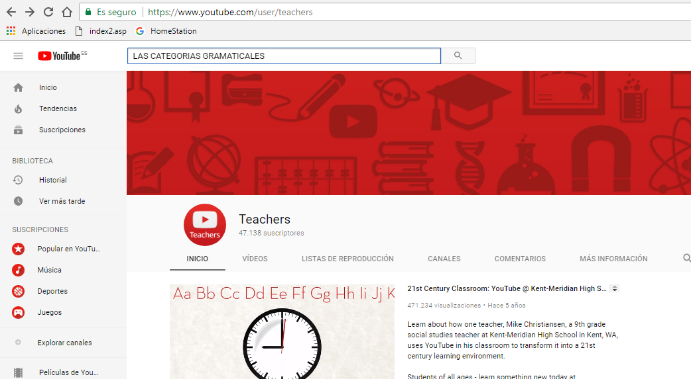

## Fase inicial. Visualización de un vídeo educativo y cuestionario on-line {#fase-inicial-visualizaci-n-de-un-v-deo-educativo-y-cuestionario-on-line}

Respetando las distintas fases que conforman el modelo pedagógico de Flipped Classroom o Aula Invertida, antes de asistir al aula, vuestro alumnado debe haber visualizado un video educativo sobre las distintas categorías gramaticales para posteriormente contestar a un cuestionario online sobre aquellas cuestiones que vosotros consideréis oportunas acerca de este contenido didáctico.

A continuación, os presento, a modo de ejemplo, una serie de vídeos educativos confeccionados por distintos profesores de Lengua Castellana y Literatura para que los alumnos en sus casas  repasen las distintas categorías gramaticales:  Video [I](https://www.google.com/url?q=https://www.youtube.com/watch?v%3DSg0BJGpMwbU&sa=D&ust=1509617244708000&usg=AFQjCNFeVXt7ichfx4UoZ1Ui8JqJ_Pq9DQ) y [II](https://www.google.com/url?q=https://www.youtube.com/watch?v%3DA501o2l9zGk&sa=D&ust=1509617244708000&usg=AFQjCNEjMy32w-iJMUAmFm4uAKNeSiz1AA)

En la sociedad educativa actual, el uso del vídeo con una finalidad didáctica está adquiriendo cada vez mayor relevancia debido a su carácter visual, inmediato y motivador para el aprendizaje del alumnado potenciando así su capacidad de comprensión y su creatividad.

Los docentes de Lengua Castellana y Literatura, a la hora de explicar los contenidos referentes a la sintaxis del castellano, sentimos que estamos introduciendo al alumnado en el mundo de la abstracción cuya comprensión exigen movernos en el nivel pragmático de la lengua. Hecho que resulta bastante complejo de desarrollar por parte del alumnado.

Con la pretensión de facilitar esta tarea, en ocasiones calificada por el alumnado de ardua, aburrida y monótona, os ofrezco una serie de herramientas tecnológicas para que podáis presentar dichos contenidos, de una manera mucho más amena, divertida y atractiva aprovechando todas las oportunidades que nos ofrece el vídeo como herramienta didáctica.

De este modo, podréis elaborar vuestros propios vídeos o aprovechar aquellos que ya se encuentran subidos a la red a los cuales podemos agregar preguntas que deben ser contestadas por el alumnado.

### Herramientas {#herramientas}

En el siguiente vídeo una profesora realiza su propia [explicación](https://www.google.com/url?q=https://www.youtube.com/watch?v%3DAkt3bJZc1YA&sa=D&ust=1509617244710000&usg=AFQjCNFsVombMMlaoMdkOA3QxMeh0HD7mw) sobre las categorías gramaticales y ,en un determinado momento, lanza una pregunta a sus alumnos para que la resuelvan. Para ello, les propone parar el vídeo, que reflexionen acerca de su posible respuesta y cuando ya consideren que han dado con ella, den al play para comprobar si es correcta o incorrecta. Es ahí cuando interviene la profesora  proporcionándoles la respuesta apropiada.

Esta opción, desde mi punto de vista,  se queda obsoleta si tenemos en cuenta la multitud de posibilidades innovadoras que nos ofrecen las herramientas weba en este aspecto tal y como váis a poder comprobar, por vosotros mismos, en los apartados siguientes.

#### Youtube Teachers {#youtube-teachers}

[Youtube teachers](https://www.google.com/url?q=https://www.youtube.com/user/teachers&sa=D&ust=1509617244711000&usg=AFQjCNEWpjHuJa_7Uy07joC-YHfoSviByQ) constituye una herramienta tecnológica gracias a la cual tanto vosotros,  como profesores, como el propio alumnado, podréis localizar con mayor facilidad y rapidez el vídeo educativo que necesitéis en cada momento, ya que éstos se encuentran clasificados tanto por ámbito temático como por nivel educativo.

Si  hacemos referencia a la cuestión que nos concierne en este momento como son las “categorías gramaticales ”, si pincháis en el  siguiente [enlace,](https://www.google.com/url?q=https://www.youtube.com/results?search_query%3Dlas%2Bcategor%25C3%25ADas%2Bgram&sa=D&ust=1509617244711000&usg=AFQjCNGx8PzNohbVehLJDAqRpRTIbbEMQQ) podréis observar cómo nos aparecen gran cantidad de vídeos educativos sobre esta temática que nosotros podemos aprovechar e incorporar en  nuestras clases de Lengua.

     

#### [Goanimate](https://www.google.com/url?q=https://goanimate.com&sa=D&ust=1509617244712000&usg=AFQjCNG1H0ySlTT5TC9oo4zDEpjKCMVz6Q) {#goanimate}

¿Quieres editar tus vídeos de clase de Lengua Castellana y Literatura de una forma diferente a la habitual? Os presento el editor de vídeos web 2.0 llamado Goanimate, por medio del cual seréis capaces de crear una gran variedad de historias animadas protagonizadas por numerosos personajes, multitud de escenarios y ambientes, y en las que podéis confeccionar sus viñetas con vuestros propios diálogos al mismo tiempo que añadís música o diálogos con vuestra voz.

De este editor de vídeos existen varias versiones, sin embargo, a nosotros nos interesa aquella cuya aplicación está destinada a los distintos centros educativos como es [Go Animated School](https://www.google.com/url?q=http://goanimate4schools.com/public_index&sa=D&ust=1509617244713000&usg=AFQjCNEnBQf8amUvCgmgmwvOMIXqX9luBg).

Mira, [mira](https://www.google.com/url?q=http://www.educacontic.es/blog/crea-videos-y-animaciones-con-go-animate&sa=D&ust=1509617244713000&usg=AFQjCNFZi67qPfarn3p_zfN_5x68CLgljQ)…

          

       

#### [Teachem](https://www.google.com/url?q=http://teachem.com/&sa=D&ust=1509617244715000&usg=AFQjCNHFOeiHrZUnN2EIp11qKNK8iQfhkQ) {#teachem}

Mediante la plataforma Teachem podéis reutilizar vídeos educativos ya existentes en Youtube para confeccionar vuestras propias lecciones educativas sobre Lengua, tanto de carácter público como privado, y agruparlas por afinidad temática según se refleja en el siguiente [vídeo](https://www.google.com/url?q=https://youtu.be/XM5FXggGVOQ&sa=D&ust=1509617244715000&usg=AFQjCNHsPZCACjpRfg9sgVsNfqp1VxyfEA).

Del mismo modo, os ofrece  esta herramienta os brinda la posibilidad de incluir diversas preguntas y comentarios ubicados a lo largo de distintas tarjetas repartidas en el transcurso del vídeo. Así, nuestro alumnado tiene la posibilidad de poder de ir contestándolas conforme vayan apareciendo durante la visualización del vídeo o, si lo prefieren, anotarlas a través del sistema SmartNotes presente en Teachem.

       

                              

#### [Loopster](https://www.google.com/url?q=https://www.youtube.com/watch?v%3D5URh7b-WOFs%26feature%3Dyoutu.be&sa=D&ust=1509617244717000&usg=AFQjCNHKsr6VX8dU2gHzrMbttzqO4XvUvw) {#loopster}

Solo necesitáis una cuenta en Facebook o Google+ para poder acceder al editor en línea de vídeos como es Loopster, gracias al cual tendréis la posibilidad de incluir en vuestras clases de Lengua virtuales tanto contenidos audiovisuales como música, transiciones, imágenes etc. de manera similar a como se  plasma en el siguiente [vídeo tutorial.](https://www.google.com/url?q=https://youtu.be/ibvaYNosyvA&sa=D&ust=1509617244718000&usg=AFQjCNGcit6-Cde4fL7sHh69ArYCDEvEAw)

Este editor destaca tanto por su sencillez como por permitir compartir los vídeos  creados en las distintas redes sociales.