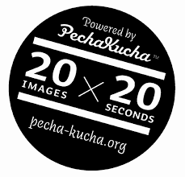
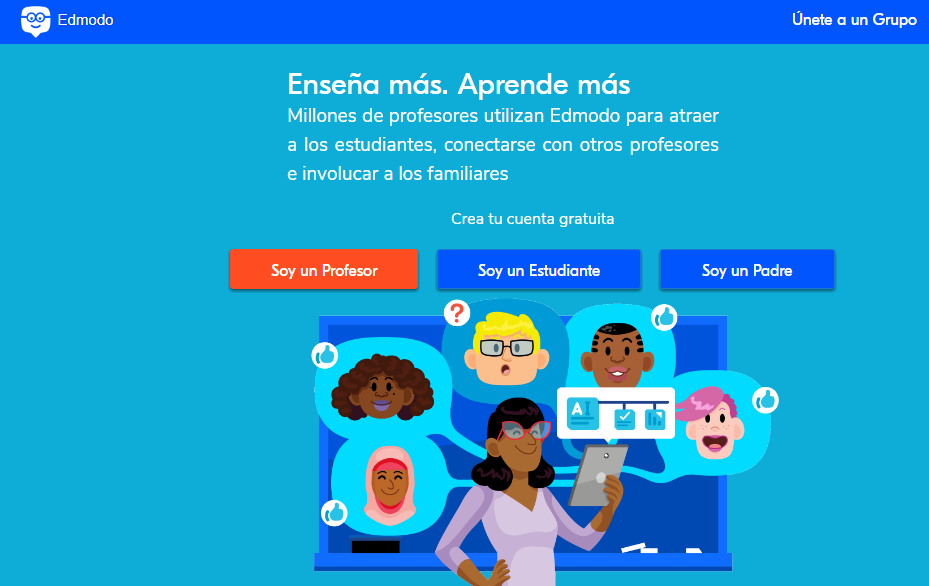
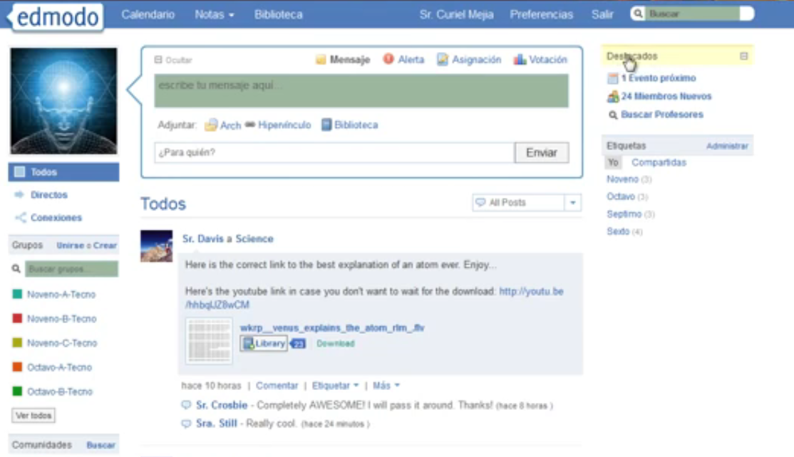
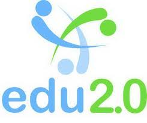
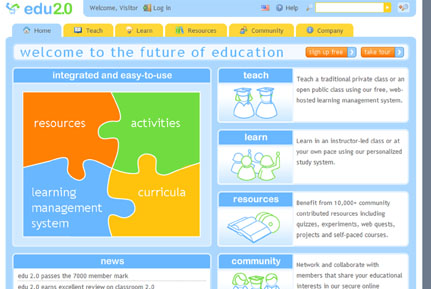

## Fase tres. En clase. {#fase-tres-en-clase}

Llega el tiempo de la reflexión,  resolución y aclaración de los contenidos no comprendidos por el alumnado en casa,  aunque también podemos obtener [Feedback](https://www.google.com/url?q=https://www.youtube.com/watch?v%3DVsJtaqcOeSw&sa=D&ust=1509617244728000&usg=AFQjCNEGputxUOJsta9a2doai5O6M3SZLw) a través de la plataforma virtual que utilicemos con nuestro curso y guiar a nuestro alumnado en su aprendizaje fuera del aula.

Una vez concluída esta primera parte, os propongo un ejemplo de tarea que proporcione una experiencia de aprendizaje significativa que podríais llevar a cabo con vuestro alumnado en el aula con la pretensión de consolidar aquellos contenidos trabajados sobre las distintas categorías gramaticales. Y es que, de esta manera,  los alumnos seleccionarán de forma activa la información relevante acerca de las categorías gramaticales a la vez que vayan confeccionando sus propios esquemas mentales.

Para ello:

1.  Organización de los alumnos en grupos de 4 miembros.
2.  A cada grupo se le adjudica una categoría gramatical determinada para que la trabaje de modo cooperativo.
3.  Cada uno de los grupos de trabajo debe realizar una presentación [Prezi](https://www.google.com/url?q=https://prezi.com/login/&sa=D&ust=1509617244729000&usg=AFQjCNEnYGDGbod76ei4q2V-GQPNI8h_mA) en la que se presenten los contenidos didácticos de una forma muy visual haciendo uso del [PechaKucha](https://www.google.com/url?q=https://www.google.es/url?sa%3Dt%26rct%3Dj%26q%3D%26esrc%3Ds%26source%3Dweb%26cd%3D7%26cad%3Drja%26uact%3D8%26ved%3D0ahUKEwjrysaS48DWAhVBEVAKHbPKB6kQFghJMAY%26url%3Dhttp%253A%252F%252Fwww.presentable.es%252Fconsejos-practicos%252F4-trucos-para-hacer-un-pechakucha-y-no-morir-en-el-intento%252F%26usg%3DAFQjCNERNaVyVjyDC4byahJeRxj3_GTLQg&sa=D&ust=1509617244730000&usg=AFQjCNG1hzKfBMp8gz-bKQtFFBf3JY3qkw) (el texto utilizado tiene que ser mínimo puesto que “PechaKucha” y “texto” no se llevan bien). En dicha presentación pueden insertar audios, vídeos con la pretensión de que resulte más amena al receptor. Para realizar dicha ´´presentación´´, deberéis proporcionar el enlace para acceder al manual de [Prezi](https://www.google.com/url?q=http://serveis.uab.cat/esid/sites/serveis.uab.cat.esid/files/Manual%2520PREZI%2520(FINAL%25202).pdf&sa=D&ust=1509617244731000&usg=AFQjCNFQDFk118v2v1q5XUmo7wjpOKDRgw) así como un [video tutorial](https://www.google.com/url?q=https://www.youtube.com/watch?v%3DtpSgub81Skg&sa=D&ust=1509617244731000&usg=AFQjCNFLc0aHAlCrKAlVDs2sTG3eXEMrnA) que guíe al alumnado en esta tarea. ‘ ‘ PechaKucha’’

                                                       

Os traigo a colación un ejemplo de [presentación  Prezi](https://www.google.com/url?q=https://prezi.com/ccmpdrotnqh5/categorias-gramaticales/&sa=D&ust=1509617244732000&usg=AFQjCNHd6WhjaH5RvT99JLF_TT3QofY9LQ) sobre las  categorías gramaticales. Sin embargo, los alumnos la tendrían que adaptar al formato PechaKucha donde predomina más la  IMAGEN que el texto.

1.  El siguiente paso consiste en realizar una exposición oral al resto de sus compañeros sobre los contenidos trabajados  a través de la herramienta Prezi.
2.  Cada grupo cuenta con una rúbrica en formato papel, que luego deben rellenar en formato digital, para ir evaluando en clase aquellos aspectos oportunos acerca de la exposición y presentación prezi confeccionada por el resto de compañeros.
3.  Finalmente, cada grupo cuelga la URL de su presentación PechaKucha en el foro habilitado para ello en la plataforma correspondiente con la que trabajemos [Google Classroom](https://www.google.com/url?q=https://classroom.google.com/u/0/h&sa=D&ust=1509617244733000&usg=AFQjCNHZuhZGYZurWpjv5dZGd8QZdwyb6A), [Moodle](https://www.google.com/url?q=https://moodle.org/?lang%3Des&sa=D&ust=1509617244734000&usg=AFQjCNG9Wj0plwdTG1_eyP4E1B-Ib-du4w), [Edmodo](https://www.google.com/url?q=https://www.edmodo.com/?language%3Des&sa=D&ust=1509617244734000&usg=AFQjCNHYJzuX7HECvfcN-b4ghN4Qq_jQEw), o [Edu 2.0](https://www.google.com/url?q=https://www.neolms.com/&sa=D&ust=1509617244735000&usg=AFQjCNG2HGfaHCBHBNbc097KADvpgffGjQ) junto con un breve mensaje.
4.  Un representante de cada grupo tiene que comentar el trabajo realizado por otro grupo, el que ha colgado la URL de su presentación Prezi con anterioridad a la de su grupo, reflejando aquellos aspectos positivos o negativos a destacar. De este modo, se incitar a  compartir tanto recursos como información por parte del alumnado..

Aunque deduzco que no desconocéis la plataforma virtual Moodle, Edmodo o Edu 2.O os pueden resultar más desconocida. Os proporciono un tutorial para que veías su funcionamiento para [profesores](https://www.google.com/url?q=https://www.youtube.com/watch?v%3D8C3DK1skAHE&sa=D&ust=1509617244736000&usg=AFQjCNFNX6HpJABF3-K3Rl8AVc1MTjc3kw) y [alumnos](https://www.google.com/url?q=https://www.youtube.com/watch?v%3DDWiO3XsE1-o&sa=D&ust=1509617244737000&usg=AFQjCNHjM_5XvY4B5GIJ38klMl3lwEdmQQ).  En Aularagón tenéis un curso sobre Edmodo.

     

Edmodo, es una plataforma gratuita apta para todos los niveles educativos, donde pueden intervenir tanto padres como alumnos y profesores, que combina la interacción presencial y virtual en el proceso de aprendizaje del alumnado mediante la elaboración de clases virtuales fomentando la participación en un entorno virtual de carácter cerrado.

En el siguiente [mapa conceptual](https://www.google.com/url?q=http://cmapspublic2.ihmc.us/rid%3D1H5DTZC1N-173ZT25-JD4/Edmodo.cmap&sa=D&ust=1509617244738000&usg=AFQjCNFr6-u_OAbPkGJ602xqgqvssfVQAQ) elaborado por Juan José de Haro se reflejan la gran cantidad de ventajas que nos aporta el uso de esta  red educativa. Así, os proporciono la siguiente [explicación](https://www.google.com/url?q=https://youtu.be/sdKiYzSWCT4&sa=D&ust=1509617244738000&usg=AFQjCNHwft5OwQEP6rbI-1lk2ecN0QVfGg) para que lo logréis con éxito.

 

Por su parte, a través del uso de la herramienta e-learning  [Edu 2.0](https://www.google.com/url?q=https://www.neolms.com/&sa=D&ust=1509617244739000&usg=AFQjCNH1ZcwVnX1aKK45RXPvntAoYp-VlQ)  en vuestras clases virtuales, podréis proporcionar  de manera fácil y sencilla tareas, recursos y materiales (audios y vídeos), elaborar Blogs, cuestionarios y resultados obtenidos por  vuestros alumnos de forma totalmente gratuita y sin tener que descargar ningún programa ya que se encuentra ubicado en la nube. Además, os permite una continua interacción con ellos tanto de forma pública en entornos de aprendizaje de carácter colaborativo, como privada. Cuenta con una versión para móviles.

Para que os animéis a usarla, os invito a que visualicéis el siguiente [video](https://www.google.com/url?q=https://www.youtube.com/watch?v%3DWkpiSMi7q_E&sa=D&ust=1509617244740000&usg=AFQjCNH3jY5cmND9V1TlAc99Fm1OQRevQw) y consultéis la siguiente [guía](https://www.google.com/url?q=http://academic.uprm.edu/~marion/guiaedu2.pdf&sa=D&ust=1509617244740000&usg=AFQjCNHCGyhL4dUC2FYGPlTgcKQEqgFUTg).                        

