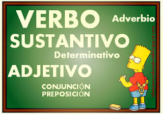

## Repaso de la categorías gramaticales {#repaso-de-la-categor-as-gramaticales}

Adentrarnos en el mundo de la Sintaxis exige, como punto de partida por parte de nuestro alumnado, el dominio y manejo de las distintas categorías gramaticales existentes en castellano, de ahí que ciertos profesores prefieran hablar más de “Morfosintaxis” que de “Sintaxis”. Y es que, en ocasiones, de forma involuntaria comenzamos hablar de sintagmas, funciones sintácticas, etc. sin haber abordado con anterioridad las categorías gramaticales.